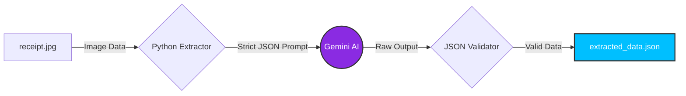

# Automated Invoice to JSON Extractor

A robust data extraction pipeline that converts unstructured physical receipts and invoices into strictly formatted JSON data using Google Gemini's Multimodal AI. This tool bridges the gap between physical paper trails and automated accounting software.

---

## System Architecture



---

## Key Features
- **Multimodal Data Processing:** Reads physical documents (images) and extracts billing information directly.
- **Strict JSON Enforcement:** Uses targeted prompt engineering to prevent the AI from outputting conversational text, ensuring only pure, machine-readable JSON is returned.
- **Data Validation:** Integrates Python's native `json` library to verify the integrity of the AI's output before saving it, preventing corrupted data from entering the database.
- **Business Ready:** Eliminates hours of manual data entry for accounting departments.

---

## Project Structure
- `json_extractor.py` - The main Python automation script.
- `receipt.jpg` - Sample input image containing invoice data.
- `extracted_data.json` - The structured output file generated by the AI.
- `.env.example` - Template for secure environment variables.

---

## VERSIONE ITALIANA (Presentazione Progetto)

### Estrattore Automatico di Fatture in JSON
La contabilità e l'inserimento manuale dei dati sono processi lenti e costosi per le aziende. Questo script risolve il problema automatizzando l'estrazione dei dati dai documenti cartacei.

### Il Vantaggio per l'Azienda
Invece di avere un dipendente che ricopia a mano i dati degli scontrini o delle fatture su Excel o sul gestionale, questo programma "legge" la fotografia dello scontrino e la converte istantaneamente in formato JSON (il formato standard utilizzato dai database e dai software di contabilità). Elimina gli errori di battitura e risparmia centinaia di ore di lavoro.

### Competenze Tecniche Dimostrate:
- **Estrazione Dati da Immagini (OCR Avanzato):** Utilizzo di modelli AI multimodali per leggere e interpretare documenti visivi.
- **Validazione dei Dati:** Uso della libreria `json` di Python per intercettare e scartare eventuali output non conformi ("allucinazioni" strutturali dell'AI).
- **Ingegneria dei Dati:** Trasformazione di dati non strutturati (pixel) in un formato altamente strutturato e pronto per l'uso aziendale (chiave-valore).

---

## Installation & Setup

1. Clone this repository to your local machine.
2. Activate your Virtual Environment:
   ```bash
   .\venv\Scripts\activate
   ```
3. Install the required dependencies:
   ```bash
   pip install google-genai python-dotenv pillow
   ```
4. Create a `.env` file in the root directory and securely add your Gemini API Key:
   ```text
   GEMINI_API_KEY=your_actual_api_key_here
   ```
5. Place a sample receipt image named `receipt.jpg` in the project folder.
6. Run the extraction script:
   ```bash
   python json_extractor.py
   ```
